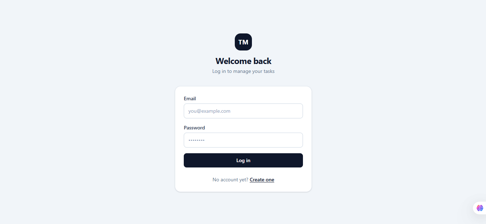
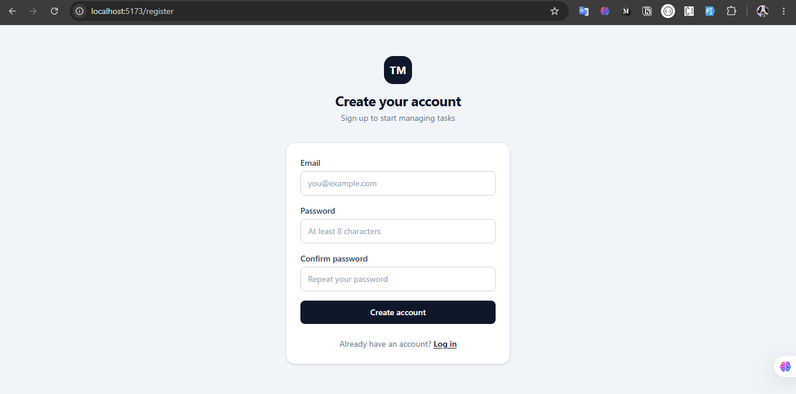
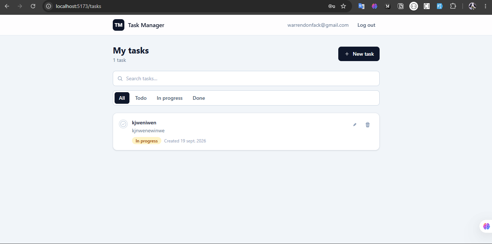
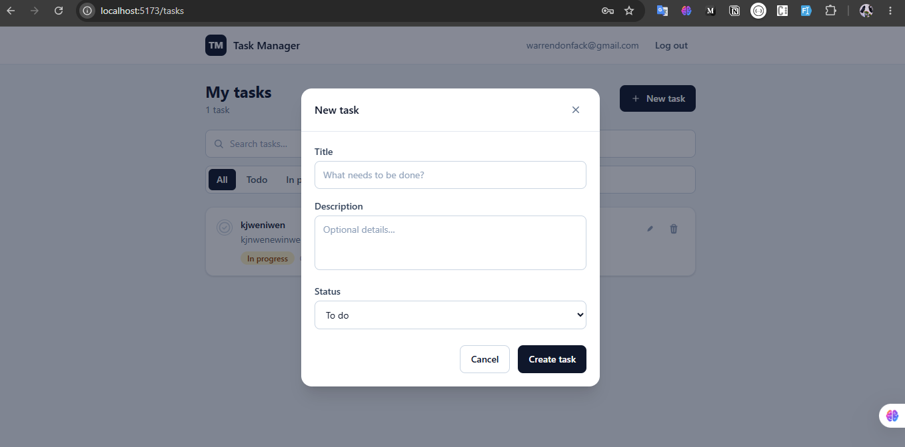
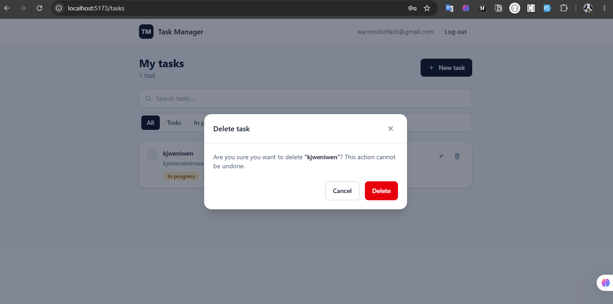

# Task Manager

A full-stack task management platform: sign up, log in, and manage your tasks
(create, edit, delete, filter, search). It runs as a Docker Compose stack
(**MySQL + Adminer + Spring Boot API + React SPA**) or locally with Maven and
Vite.

## Screenshots

| | |
|---|---|
|  |  |
|  |  |
|  | |

## Features

- **Authentication** — email/password registration and login, stateless JWT
  (HS256), passwords hashed with BCrypt.
- **Task management** — create, read, update and delete your own tasks
  (title, description, status `TODO` / `IN_PROGRESS` / `DONE`).
- **Filtering & search** — filter by status, search by title/description,
  server-side pagination.
- **Ownership isolation** — every query is scoped to the logged-in user.
- **Show/hide password** — eye / eye-slash toggle on every password field.
- **API documentation** — Swagger UI served by the backend.
- **Uniform errors** — every error is returned as a consistent JSON body.

## Tech stack & architecture

| Layer | Stack |
| ----- | ----- |
| Backend | Spring Boot 3.4 (Java 21, Maven) · Spring Security + JWT · JPA/Hibernate · Flyway migrations · springdoc (Swagger) · Actuator health |
| Frontend | React 18 + TypeScript + Vite · Tailwind CSS 4 · React Router · TanStack Query · React Hook Form + Zod · Axios |
| Data / infra | MySQL 8 · nginx (serves the SPA and proxies `/api`) · Docker Compose |

The backend exposes a REST API under `/api`. The frontend is a single-page
app; in Docker it is served by nginx, which forwards `/api/*` to the backend
so the browser always talks to one origin.

```
└─ task-manager/
   ├─ backend/            Spring Boot REST API (Maven, Java 21)
   │  └─ src/main/resources/db/migration/   Flyway SQL migrations
   ├─ frontend/           React SPA (Vite + TypeScript + Tailwind)
   ├─ docs/images/        Screenshots
   ├─ docker-compose.yml  Full stack: MySQL + Adminer + backend + frontend
   ├─ .env.example        Environment variables template
   └─ README.md
```

## What happens when you start the stack (startup order)

`docker-compose.yml` already implements a safe startup order: each container
waits for the one it depends on (healthcheck), so you **never** start them in
the wrong order by hand.

```
docker compose up -d --build
        │
        ▼
 1. mysql ────────► first start: creates the database + the app user
                     automatically from MYSQL_DATABASE / DB_USERNAME / DB_PASSWORD
                     healthcheck: mysqladmin ping
        │
        ▼
 2. adminer ──────► GUI for the database (optional, not required by the app)
                     starts once mysql is healthy  → http://localhost:8083
        │
        ▼
 3. backend ──────► waits for mysql healthy, then Flyway applies the schema
                     (tables users, tasks)  → API on http://localhost:8080
        │
        ▼
 4. frontend ─────► waits for backend healthy, nginx serves the SPA
                     and proxies /api to the backend → http://localhost:3000
```

> **About the database:** in the **default** flow the MySQL container creates
> the database (`taskmanager`) and the user (`taskuser`) by itself when the
> data volume is created for the first time, and the backend builds the tables
> with Flyway. **No manual step is required.**
>
> Starting the DB manually with Adminer is only necessary if you want to use a
> **different database name**, start from scratch, or prefer full manual
> control. See [Option B](#option-b-manual-database-creation-via-adminer).

## Prerequisites

- **Git**
- **Docker** with the **Docker Compose** plugin (Docker Desktop on
  Windows/macOS includes both)
- Optional — to run outside Docker:
  - Java **21** + Maven **3.9+**
  - Node.js **20+** + npm
  - MySQL **8** (or reuse the compose `mysql` service)

## Install & run in Docker (recommended)

### 1. Get the project

```bash
git clone <repository-url>
cd task-manager
```

### 2. Configure the environment

```bash
cp .env.example .env
```

Edit `.env` (at the repository root):

- Generate and set a strong `JWT_SECRET` (required, ≥ 32 bytes):

  ```bash
  openssl rand -base64 48
  ```

- Adjust the database passwords if you like (`DB_PASSWORD`, `MYSQL_PASSWORD`).
- Ports are overridable: backend → `BACKEND_PORT` (default `8080`),
  frontend → `FRONTEND_PORT` (default `3000`), database UI →
  `ADMINER_PORT` (default `8081`).

### 3. Start the whole stack

```bash
docker compose up -d --build
```

Compose builds the backend and frontend images, starts `mysql` first, then
`adminer`, the `backend` (which runs the Flyway migrations), and finally the
`frontend`. First run takes a few minutes (images build + MySQL init).

### 4. Check that everything is healthy

```bash
docker compose ps
```

All services should be `Up ... (healthy)`. The URLs are:

| Service              | URL (defaults)                    |
| -------------------- | --------------------------------- |
| **App (frontend)**   | http://localhost:3000             |
| API                  | http://localhost:8080/api         |
| Swagger UI           | http://localhost:8080/swagger-ui.html |
| API health           | http://localhost:8080/actuator/health |
| **Adminer (DB UI)**  | http://localhost:8081             |

### 5. Use the app

Open the app URL, click **Create one**, register an account, then log in and
start creating tasks.

### Option B: manual database creation via Adminer

If you prefer to create the database yourself (or use a custom `DB_NAME`),
follow this exact order:

1. Start only the database stack first:

   ```bash
   docker compose up -d mysql adminer
   ```

2. Open Adminer → http://localhost:`ADMINER_PORT` (default http://localhost:8081).

3. Log in with the values from your `.env`:

   | Field    | Value                                    |
   | -------- | ---------------------------------------- |
   | System   | `MySQL`                                  |
   | Server   | `mysql` (the service name/container host) |
   | Username | `root` + password `MYSQL_ROOT_PASSWORD` (or `DB_USERNAME` / `DB_PASSWORD`) |
   | Database | leave empty                              |

4. Create the database **exactly named** `DB_NAME` (default `taskmanager`).

5. Now start the rest of the stack:

   ```bash
   docker compose up -d --build backend frontend
   ```

   The backend applies the Flyway migrations; the frontend then starts only
   when the backend is healthy.

> The Adminer UI uses the same MySQL instance as the app. Whether you let
> MySQL create the database automatically (Option A, default) or create it
> manually (Option B), the backend expects it under `DB_NAME` with user
> `DB_USERNAME` / password `DB_PASSWORD`.

## Run locally (without full Docker)

Workflow when you want fast live-reload development.

### Backend

```bash
cd backend
```

Point it at a MySQL database (either the compose `mysql` container or your
own). Example with the compose container:

```bash
docker compose up -d mysql
```

Create the database if needed, then export the config and run (MySQL
credentials default to `localhost:3306` / `taskmanager` / `taskuser`):

```bash
export DB_HOST=localhost DB_PORT=3306 DB_NAME=taskmanager
export DB_USERNAME=taskuser DB_PASSWORD=task_password
export JWT_SECRET="$(openssl rand -base64 48)"
export SERVER_PORT=8081   # optional; Spring reads server.port from SERVER_PORT
mvn spring-boot:run       # → http://localhost:8081
```

Run the tests:

```bash
mvn test
```

### Frontend

```bash
cd frontend
npm install
```

Create `frontend/.env.development` if it does not exist yet, pointing at your
backend:

```bash
# frontend/.env.development
VITE_API_URL=http://localhost:8081/api
```

> In local dev the API URL must be a **full URL to the backend**. The `/api`
> prefix is only valid inside Docker (where nginx proxies it).

```bash
npm run dev        # → http://localhost:5173
npm test           # Vitest
```

For Docker-based local use of the backend (the compose service published on
`BACKEND_PORT`), keep `VITE_API_URL` in sync with that port and make sure your
`CORS_ALLOWED_ORIGINS` includes `http://localhost:5173` — it does by default.

## Configuration

Docker Compose and the backend read the root `.env`. The frontend reads its
**own** file (`frontend/.env` or `frontend/.env.development`).

| Variable               | Default                     | Description                                    |
| ---------------------- | --------------------------- | ---------------------------------------------- |
| `MYSQL_ROOT_PASSWORD`  | `root_password`             | MySQL root password                             |
| `MYSQL_DATABASE`       | `taskmanager`               | Database auto-created by MySQL on first start  |
| `DB_NAME`              | `taskmanager`               | Database the backend connects to                |
| `DB_USERNAME` / `DB_PASSWORD` | `taskuser` / `task_password` | App DB user                         |
| `JWT_SECRET`           | **required**                | ≥ 32 bytes; `openssl rand -base64 48`          |
| `CORS_ALLOWED_ORIGINS` | `http://localhost:5173`     | Comma-separated browser origins allowed        |
| `BACKEND_PORT`         | `8080`                      | Host port of the backend container             |
| `FRONTEND_PORT`        | `3000`                      | Host port of the frontend container            |
| `ADMINER_PORT`         | `8081`                      | Host port of the Adminer container             |
| `VITE_API_URL`         | `/api`                      | API base URL baked into the SPA (Docker)        |

## API overview

Base URL: `/api`. Task endpoints require `Authorization: Bearer <jwt>`.

| Method | Path                  | Description                                            |
| ------ | --------------------- | ----------------------------------------------------- |
| POST   | `/api/auth/register`  | Create an account, returns a JWT                      |
| POST   | `/api/auth/login`     | Log in, returns a JWT                                 |
| GET    | `/api/tasks`          | My tasks (`status`, `search`, `page`, `size`)         |
| POST   | `/api/tasks`          | Create a task                                         |
| PUT    | `/api/tasks/{id}`     | Update one of my tasks                                |
| DELETE | `/api/tasks/{id}`     | Delete one of my tasks                                |

Errors:

```json
{ "timestamp": "…", "status": 404, "error": "Not Found", "message": "…", "path": "…" }
```

## Troubleshooting

- **`POST /auth/register` returns `405 Method Not Allowed`** — the frontend
  image was built without the `/api` prefix (stale bundle). Rebuild it through
  compose so `VITE_API_URL=/api` is baked in:

  ```bash
  docker compose up -d --build frontend
  ```

  Avoid `docker build ./frontend` directly: it bypasses the compose build
  arguments.

- **`403 Invalid CORS request`** — the backend received a request from a
  browser origin not listed in `CORS_ALLOWED_ORIGINS`. Add your frontend
  origin (for example `http://localhost:3100` if `FRONTEND_PORT=3100`) to that
  variable in `.env`, then restart the backend:

  ```bash
  docker compose up -d backend
  ```

- **Backend stays unhealthy** — MySQL may still be initializing or the Flyway
  migration is running. Wait a few minutes and check `docker compose ps`.
  Check logs with `docker compose logs backend`.

- **Port already in use** — change `BACKEND_PORT`, `FRONTEND_PORT` and/or
  `ADMINER_PORT` in `.env` and run `docker compose up -d`. Keep
  `CORS_ALLOWED_ORIGINS` in sync with the frontend port (see above).

- **Reset everything (fresh database)** — this deletes the MySQL data volume:

  ```bash
  docker compose down -v
  ```

## Useful commands

```bash
docker compose ps              # status of all containers
docker compose logs -f backend # follow backend logs
docker compose up -d --build   # rebuild + start
docker compose down            # stop (keep data)
docker compose down -v         # stop and wipe data volumes
mvn test                       # backend tests (H2)
mvn package                    # build the backend jar
npm test                       # frontend tests (Vitest)
npm run build                  # type-check + production build (frontend)
```